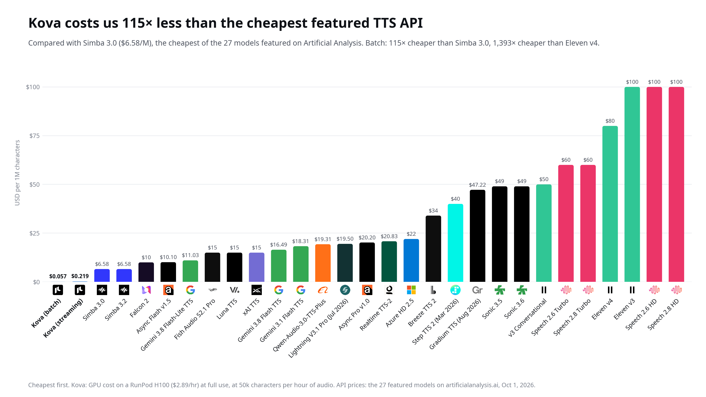
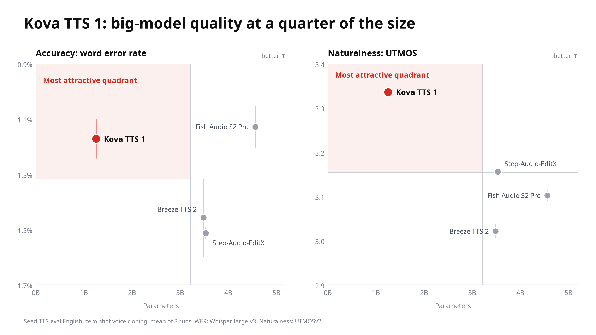

<div align="center">
  <a href="https://kova.ai"></a>
  <br>
  <a href="https://huggingface.co/kova-ai/kova-tts-1"></a>
  <a href="https://kova.ai"></a>
  <a href="https://discord.com/invite/tBw298ggQQ"></a>
  <a href="https://www.linkedin.com/company/kova-tts/posts/?feedView=all"></a>
  <a href="https://apps.apple.com/us/app/kova-ai-audio-series/id6744546041"></a>
</div>

> [!IMPORTANT]
> Kova TTS 1 is available under the [Research and Non-Commercial Model License](LICENSE). Commercial use requires a separate written commercial license from Kova AI. See [License and attribution](#-license-and-attribution).

> [!NOTE]
> **AI agents and coding assistants:** read the [`docs/`](docs/index.md) folder before changing
> code or answering questions about this repository. It documents the architecture, every
> command, the server protocol and the design decisions behind them.

## 📚 The story behind Kova TTS 1

Kova started as an [AI audiobook app](https://apps.apple.com/us/app/kova-ai-audio-series/id6744546041) with a simple dream: **let anyone listen to their stories, read by a voice they love.** As we grew to 10,000 listeners, we needed to synthesize more than a million minutes of audio, and none of the models available fit what we needed. They were too expensive at that scale, didn't sound right for long-form narration, or couldn't be used commercially. So we decided to build our own.

We trained Kova TTS 1 specifically for audiobook reading: warm, natural, and pleasant to listen to for hours at a time. Some of our favorite memories from this project are of voice actors coming into the office to record with us, and the moment we first heard their cloned voices narrating a chapter they had never read aloud. Training this model was a blast from start to finish, and today we're excited to share it with the community.

> The licensed voice actor voices we use on [kova.ai](https://kova.ai) can't be published here, but we've documented exactly [how to clone a voice yourself](#-voice-cloning-and-pretrained-voices), so you can recreate that same special experience: your story, read by the voice of your dreams ✨

<div align="center">
  
  <br>
  <em>What it costs us to run Kova on rented GPUs, compared with API prices featured on Artificial Analysis.</em>
</div>

<div align="center">
  
  <br>
  <em>Zero-shot voice cloning on Seed-TTS-eval English, all models run in the same harness with their default settings.</em>
</div>

---

## 📖 Overview

Kova TTS 1 is an English text-to-speech model built on Llama 3.2 1B, with streaming
generation, voice cloning, and **48 kHz mono audio output**. This repository is its runtime:
inference, voice cloning, word timestamps, a local server, a browser demo, and LoRA finetuning.

| Package | Role |
|---|---|
| [`kova-tts`](packages/kova-tts) | The model: inference, normalization, word alignment, voice cloning, server, LoRA finetuning |
| [`kova-codec`](packages/kova-codec) | The codec: 32 kHz waveforms -> codes at 80 tokens/second -> 48 kHz waveforms |

📘 [Documentation](docs/index.md) (or `uv run mkdocs serve` for the rendered site) ·
🤗 [Model](https://huggingface.co/kova-ai/kova-tts-1) ·
🗣️ [Pretrained voices](https://huggingface.co/kova-ai/kova-tts-1-voices)

## ✨ Highlights

- 📚 **Built for Narration** — Trained for audiobook reading: warm, natural, and pleasant to listen to for hours.
- 🎙️ **Voice Cloning** — Clone a voice from reference audio and its matching transcript, with no fine-tuning required.
- 🔊 **48 kHz Output** — High-fidelity mono audio from a neural codec with a 48 kHz decoder.
- 📢 **16 and 32 kHz Inputs** — Naturally upsamples low-quality audio while maintaining the highest fidelity.
- ⏱️ **Word Timestamps** — Align audio with text for read-along highlighting, subtitles, and precise editing.
- 🔢 **Text Normalization** — Numbers, abbreviations, and unusual spellings are expanded automatically with the `normalize` extra, so text can be passed in as written.
- ⚡ **Low Latency** — ~190 ms warm time to first audio on an RTX 5090 with the local runtime, and under 100 ms in our optimized H100 serving system.
- 🌊 **Streaming** — Stream from Python, HTTP Server-Sent Events, or WebSocket.
- 🧩 **Pretrained Voices** — Five optional LoRA voice adapters, or fine-tune your own.
- 💻 **Runs Locally** — NVIDIA CUDA, Apple Silicon, or CPU.

## 📊 Model at a glance

| Property | Details |
| --- | --- |
| Language | English |
| Backbone | Llama-3.2-1B |
| Audio output | 48 kHz, mono |
| Audio representation | 80 tokens/second; 8,192-entry single layer RVQ codebook |
| Streaming | Python, HTTP Server-Sent Events, and WebSocket |
| Voice cloning | Reference audio and its matching transcript; no fine-tuning required |
| Word timestamps | 13.7M parameter audio aligner straight from codec tokens |
| Pretrained voices | Five optional LoRA adapters in the separate voice repository |
| Hardware | NVIDIA CUDA; Apple Silicon through torch on Metal; CPU supported but slow |

This is a model and local inference release. The included server is intended for
local use, experimentation, and integration development; it is **not a production
server release**. See [Performance and deployment](#-performance-and-deployment).

## 🎧 Try it

> 📝 *"Originally, we built our own voice model for internal use because we couldn't find one that made the unit economics work. Over time, we realized the technology had potential far beyond our own needs. So, we decided to make it public, hoping it could unlock entirely new categories of businesses and experiences that simply haven't been possible at current industry pricing."*

Listen:


https://github.com/user-attachments/assets/e2465db7-a695-4534-96a5-f9d237fdcc33


> Note: these voices are from our production API, which we do not have permission to release. The demo provides some publicly available voices as reference.

Experiment in the [hosted demo](https://kova.ai), or run the local browser demo with the
quickstart below.

## 🚀 Quickstart

Requires Python 3.10+ and [uv](https://docs.astral.sh/uv/). Each quickstart installs the
browser demo and text normalization, downloads the model, and starts the demo — the full
experience: streaming playback, word-by-word highlighting, the installed voices, and voice
cloning.

### NVIDIA GPU (Linux)

```bash
git clone https://github.com/evalabs-ai/kova-tts
cd kova-tts
uv sync --extra demo --extra normalize
uv run kova-tts download
uv run kova-tts demo --preload
```

### Apple Silicon (macOS)

Text normalization needs pynini, which has no macOS wheels, so it is built against
Homebrew's OpenFst:

```bash
brew install openfst
git clone https://github.com/evalabs-ai/kova-tts
cd kova-tts
CPPFLAGS="-I$(brew --prefix)/include" LDFLAGS="-L$(brew --prefix)/lib" \
  uv sync --extra demo --extra normalize
uv run kova-tts download
uv run kova-tts demo --preload
```

If the pynini build fails, run `uv sync --extra demo` instead: everything works, and text is
spoken exactly as written.

The published checkpoint runs under torch on Metal. **Converting it to MLX is recommended**, as
MLX is faster on Apple Silicon, but we do not provide a converted checkpoint.
[Apple Silicon](docs/apple-silicon.md) describes the format the MLX backend expects and how to
run one with `--extra mlx`.

### Then

Open <http://127.0.0.1:7860>, type something, and press **Generate**. Audio starts playing while
the rest is still being generated. Other platforms (Linux ARM, Windows, CPU-only) and offline
installs are covered in [Installation](docs/installation.md).

## 🐍 From Python

```python
from kova_tts import KovaTTS

tts = KovaTTS.from_pretrained()
wav = tts.generate("Hello world.")  # float32 mono audio at 48 kHz
tts.save(wav, "out.wav")

wav, words = tts.generate("It costs $12.50.", timestamps=True)  # with word timestamps
```

The same from the command line:

```bash
uv run kova-tts generate "Hello world." --out out.wav
uv run kova-tts --help    # paths, generate, prepare-data, finetune, merge, serve, demo, download
```

See the [Python API](docs/python-api.md) and [CLI](docs/cli.md) references.

## 🎙️ Voice cloning and pretrained voices

Clone a voice using a reference recording and a transcript that matches it word for word:

```python
voice = tts.clone("reference.wav", transcript="Exactly what the reference clip says.")
wav = tts.generate("A new sentence in the reference voice.", voice)
tts.save(wav, "cloned.wav")
```

Reference files are encoded at **32 kHz**, or natively at **16 kHz** when the recording is
below 32 kHz (phone audio, most speech datasets). The decoder produces **48 kHz output**. See the
[voice cloning guide](docs/voice-cloning.md) for reference-audio preparation and optional
automatic transcription. You are responsible for having the rights to the voice you clone.

For ready-to-use voices, download the
[five pretrained LoRA adapters](https://huggingface.co/kova-ai/kova-tts-1-voices):
`bdl`, `slt`, `jmk`, `awb`, and `Kathleen`. The base model also works without an adapter.

```bash
uv run hf download kova-ai/kova-tts-1-voices --local-dir ./voices
export KOVA_LORA_DIR="$PWD/voices"
```

To train your own adapter, see the [fine-tuning guide](docs/finetuning.md).

## ⚡ Performance and deployment

Measured on an RTX 5090, at batch 1 with bfloat16 and a 4,096-token KV cache:

| Measurement | Reported result |
| --- | --- |
| CUDA-graph model decode throughput | \~330 audio tokens/second (~4.1x real time) |
| Warm time to first audio, in-process | ~190 ms |
| Warm time to first audio, over WebSocket with text already sent | ~200 ms |
| Warm time to first audio, over Server-Sent Events | ~230 ms |

Model decode throughput measures audio-token generation; it is not a measurement of
end-to-end serving capacity. First-use model loading and codec warm-up add latency.
See the [benchmark context](docs/index.md#performance).

With production serving optimizations on NVIDIA H100 GPUs, Kova achieves
**under 100 ms time to first audio** in our optimized serving system. The local
runtime in this repository is a separate implementation with the measurements
shown above.

The local server processes one utterance at a time and has no built-in authentication.
A production deployment requires its own access control, concurrency management,
and serving optimizations. The hosted service at [kova.ai](https://kova.ai) is
operated separately from this local runtime. See
[Architecture](docs/architecture.md#deliberate-non-features) for the reasons behind these limits.

## ⚠️ Limitations

- 🌍 English speech generation; other languages are not supported by this release.
- 🎚️ Voice cloning depends on reference-audio quality and an accurate transcript.
- 🖥️ Generation speed and first-audio latency depend on hardware, warm-up, input text,
  and the serving configuration.

## 🏗️ Architecture and model files

The Llama backbone predicts discrete audio tokens, and a neural codec converts them
to speech. The codec uses an 80-token/second representation with a 48 kHz decoder.
See the [architecture guide](docs/architecture.md) for the token layout, codec, and streaming
implementation.

The [model repository](https://huggingface.co/kova-ai/kova-tts-1) holds the model
configuration, weights, and tokenizer files at its root. `codec.pt` is the audio codec
checkpoint used to turn generated codes into speech. `alignment.pt` is the 13.7M-parameter CTC
aligner behind word timestamps; it reads the generated codes, not the audio. WavLM is fetched
separately from `microsoft/wavlm-large` when encoding audio for voice cloning; base speech
generation does not require it.

## 🧰 What else is here

| | |
|---|---|
| [Local server](docs/server.md) | HTTP, Server-Sent Events, and a streaming WebSocket session |
| [Browser demo](apps/demo/README.md) | Gradio, streaming playback, word highlighting, voice cloning |
| [ComfyUI nodes](apps/comfyui/README.md) | Load once, generate, clone |
| [Docker](docker/README.md) | The server and demo in a CUDA image |
| [Dataset preparation](docs/dataset-preparation.md) | A folder of your recordings -> a JSONL corpus |
| [LoRA finetuning](docs/finetuning.md) | A per-voice adapter, ~55 MB, minutes on one GPU |

## 🛠️ Development

```bash
uv sync --extra server --extra demo --extra data --extra finetune --extra normalize
uv run pytest                                 # everything, including GPU and weight-backed tests
uv run pytest -m "not gpu and not weights"    # what CI runs
uv run ruff check . && uv run ruff format .
uv run mkdocs build --strict                  # the docs site
```

Tests that need a CUDA device are marked `gpu`; tests that need real checkpoints are marked
`weights`. CI runs neither.

## 📜 License and attribution

Use is governed by the [Research and Non-Commercial Model License](LICENSE).
Commercial use of Kova-provided source code, base-model weights, documentation, derived models,
or generated output requires a separate written commercial license from Kova AI.
Third-party components retain their own license terms; see [NOTICE](NOTICE)
and the [full upstream license texts](licenses/third-party/README.md).

The pretrained LoRA voices also have a
[Voice Package Supplement](https://huggingface.co/kova-ai/kova-tts-1-voices/blob/main/LICENSE-SUPPLEMENT)
and [voice NOTICE](https://huggingface.co/kova-ai/kova-tts-1-voices/blob/main/NOTICE).
See [LICENSE-WEIGHTS](LICENSE-WEIGHTS) for the model repository links.

Built with [Kova TTS](https://kova.ai/text-to-speech). Built with Llama.

📬 License questions: legal@evalabs.ai.

## 👋 Team

Built in Montréal by the [Kova team](https://kova.ai/team).

| Team member | Connect |
| --- | --- |
| Ryan Reszetnik | [LinkedIn](https://www.linkedin.com/in/ryan-reszetnik/) |
| Henri-Charles Machalani | [X](https://x.com/hmachalani) · [LinkedIn](https://www.linkedin.com/in/henri-charles-machalani/) |
| Olivier Déry-Prévost | [X](https://x.com/Zupooli) · [LinkedIn](https://www.linkedin.com/in/olivierdp/) |
